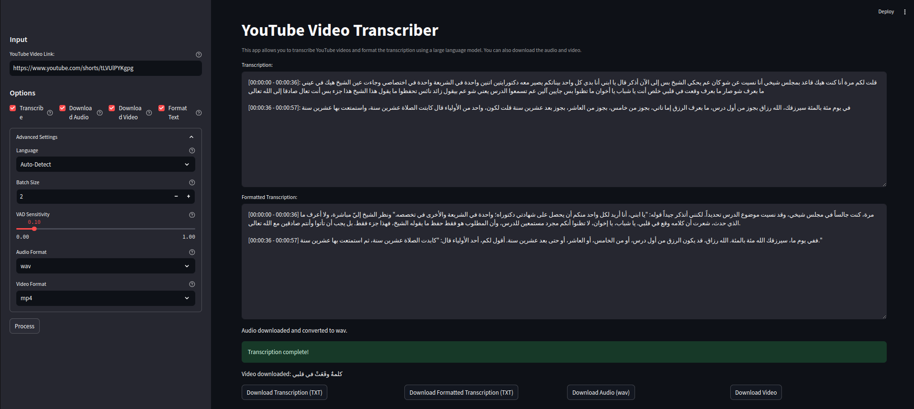

# YouTube Video Transcriber

A Streamlit app that transcribes YouTube videos using Whisper, with optional formatting using a large language model, audio download, and video download.

## How it works

- Downloads audio from YouTube videos using `yt-dlp`.
- Splits audio into speech segments using Silero VAD.
- Transcribes segments in batches using OpenAI's Whisper model.
- Formats the transcription using a large language model (if selected).
- Displays transcribed text with timestamps.
- Provides options to download the raw transcription, formatted transcription, audio, or video.

## Requirements

Listed in `requirements.txt`

## Usage

1. Install dependencies: `pip install -r requirements.txt`
2. Run the app: `streamlit run app.py`
3. Enter a YouTube video URL.
4. Choose options: Transcribe, Download Audio, Download Video, Format Text.
5. Select a language or use auto-detect (under "Advanced Settings").
6. Click "Process".

## Screenshot

## License

MIT
"# YouTube-Transcriber" 
